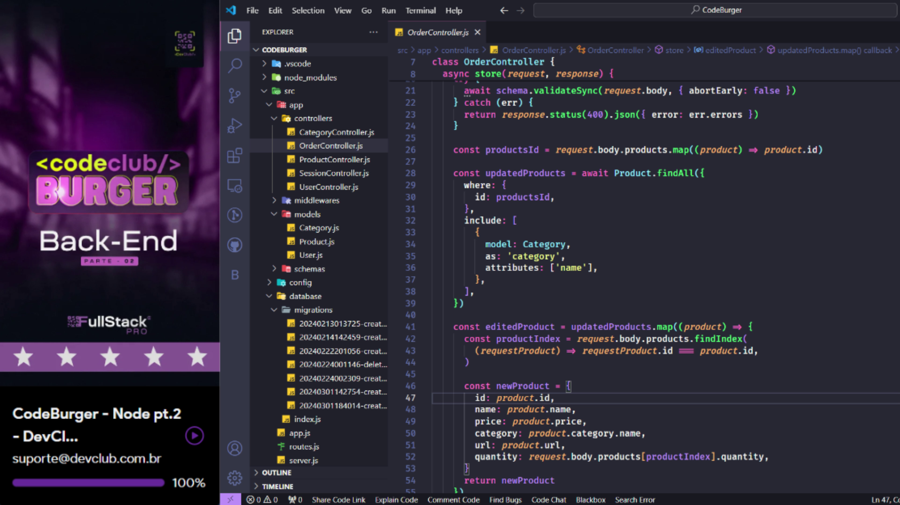
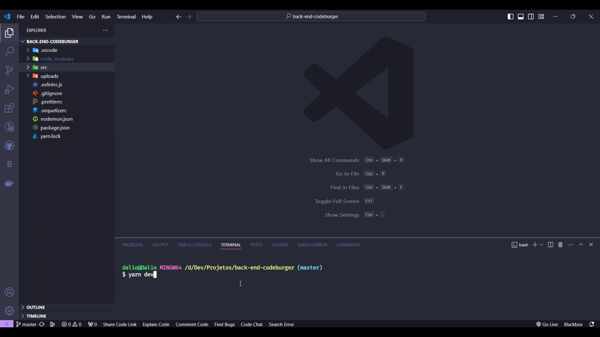
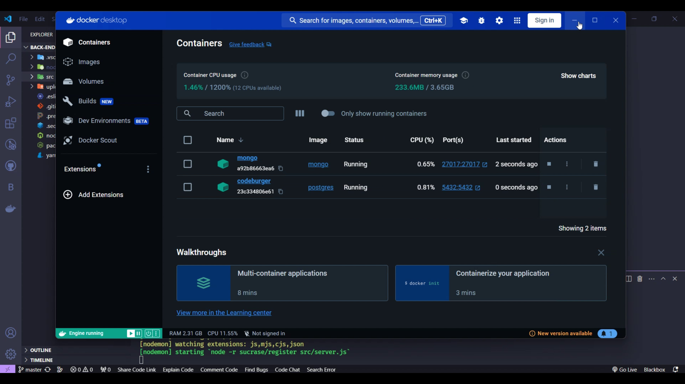
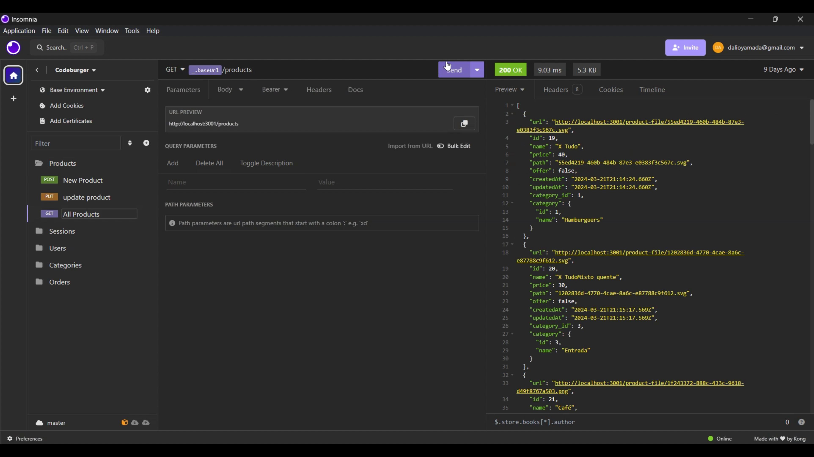
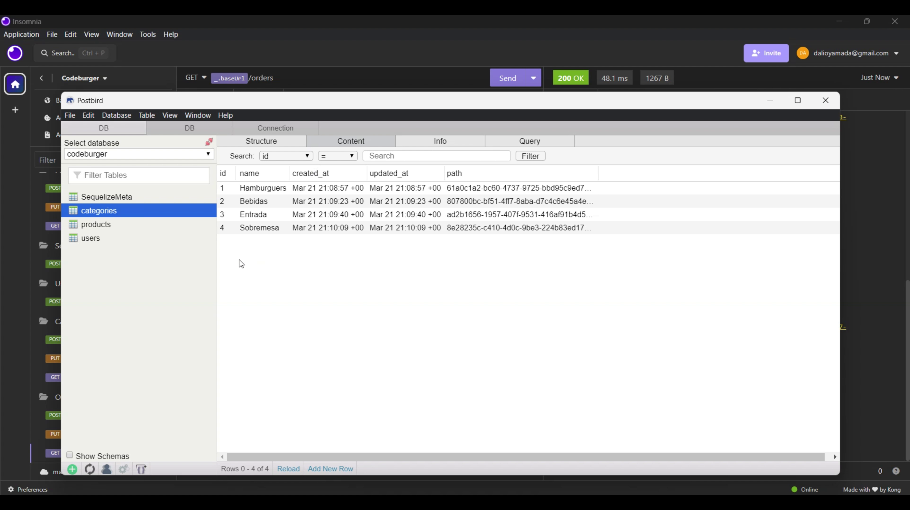
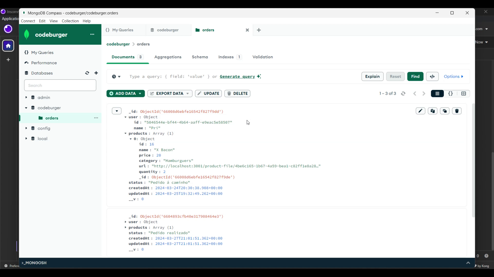

<h1 align="center">Back-End CodeBurguer</h1>

<h2>Olá sejam bem-vindo</h2>

Projeto Back-End CodeBurguer

Hoje compartilho com vocês mais recente projeto profissional: o desenvolvimento do back-end de uma hamburgueria!

Este projeto foi realizado em conjunto com o meu mentor, Rodolfo Mori, e foi uma experiência incrível de aprendizado e crescimento profissional.

<h4>Tecnologias:</h4>
<ul>
<li>⚙ React: Interface do usuário administrativa moderna e responsiva.</li>
<li>🐋 Docker: Contêinerização para escalabilidade e portabilidade.</li>
<li>🍃 MongoDB: Armazenamento de dados NoSQL flexível e escalável.</li>
<li>🐘 PostgreSQL: Armazenamento de dados relacional para pedidos e relatórios.</li>
<li>🔷 Sequelize: ORM para abstração de acesso ao banco de dados.</li>
<li>✅ Node.js: API RESTful robusta e performante.</li>
<li>✔ Insomnia: Ferramenta de teste e documentação da API.</li>
</ul>

Este projeto me proporcionou a oportunidade de aprofundar meus conhecimentos em diversas tecnologias de back-end, como Node.js, Express, bancos de dados relacionais e não relacionais, Docker, testes automatizados e segurança.

Gostaria de agradecer ao meu mentor, Rodolfo do Dev Club, pelo seu apoio, orientação e valiosos ensinamentos durante todo o desenvolvimento deste projeto.

<h4>Link:</h4>

>Repoditório:https://github.com/heltonjuniodesouza

#hamburgueria #backend #nodejs #express #typescript #postgresql #sequelize #mongodb #mongoose #docker #jest #mocha #jwt #insomnia #swagger #desenvolvimentodesoftware #tecnologia #aprendizado #crescimento #profissional

 

  <ul align="center">
    <h2 style="display: inline-block">Imagens:</h2>
  </ul>

 
  
  
  
  
  
  

